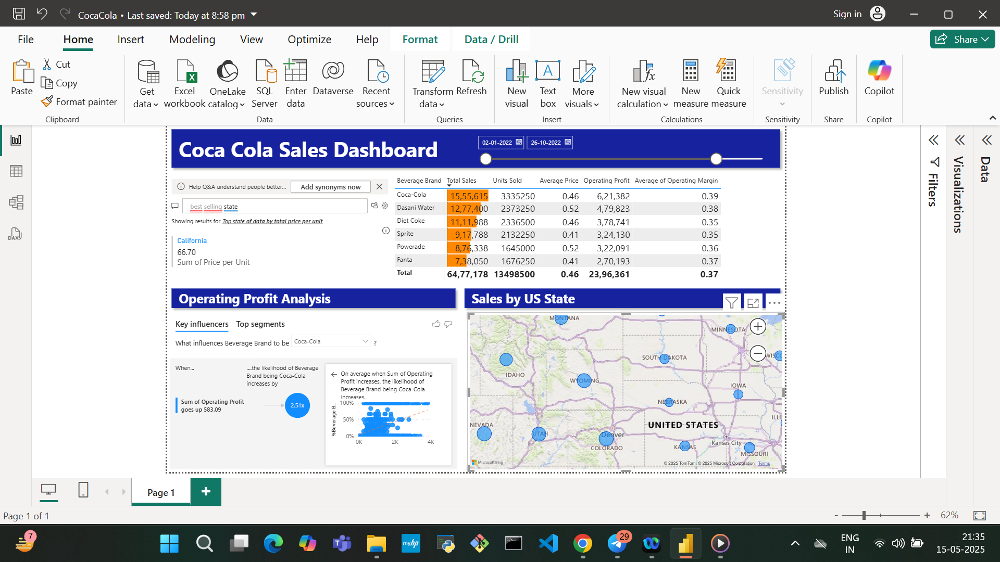
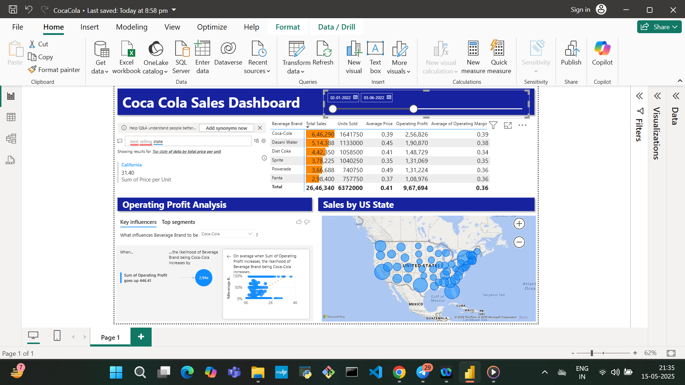

# 📊 Power BI Dashboard: Business Performance Insights

Welcome to my first Power BI project! This dashboard is a comprehensive, interactive tool designed to help users gain key insights into business performance through a variety of visual analytics components.

## 🔍 Project Overview

This dashboard showcases my growing skills in data analysis and visualization using Microsoft Power BI. It presents a full view of business metrics, including profitability, regional sales, and financial health, all within a sleek, user-friendly interface.

## 📈 Features

- **🤖 AI-Powered Q&A Visual**  
  Ask natural language questions to explore your data intuitively.

- **📊 Key Influencers Visual**  
  Analyze profit margins per brand and identify drivers of performance using machine learning-powered insights.

- **🗺️ Map Chart**  
  Visualize sales by region with geographic context.

- **📐 Financial Matrix**  
  Dive into granular data such as price per unit, total revenue, and operating profit.

- **📅 Dynamic Timeline Slicer**  
  Interactively filter the data based on custom date ranges.

## 🛠️ Tools & Technologies

- Microsoft Power BI
- DAX (Data Analysis Expressions)
- Power Query
- Excel (for initial data prep)

## 📁 Files Included

- `CocaCola_DashBoard.pbix` – The main Power BI project file.
- `README.md` – Project documentation.
- `data/` – Sample or anonymized dataset used for the dashboard.

> Note: Actual business data has been anonymized or replaced with sample data to protect confidentiality.

## 🚀 How to Use

1. Clone this repository.
2. Open the `.pbix` file in Power BI Desktop.
3. Explore visuals or connect your own data sources for customization.
4. Use the Q&A, filters, and timeline to gain new insights.

## 📌 Learning Goals

This project helped me learn and apply:
- Interactive data storytelling
- Dynamic filtering and slicers
- Predictive insights with AI visuals
- Financial KPI analysis using matrices

## 📸 Dashboard Preview

## 🤝 Connect

If you find this useful or have suggestions, feel free to connect with me on [LinkedIn](https://www.linkedin.com/in/gyanendu-bikash-boitai-a91b1b186/) or drop a star ⭐ on this repo!

---

**#PowerBI** • **#DataAnalytics** • **#DashboardDesign** • **#DataVisualization** • **#LearningByDoing**

